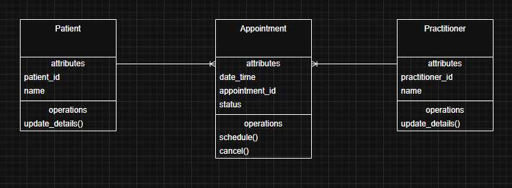

SmartCare v0.3 - Domain Model Workbook

Week 6 student resource

# Requirement-to-Concept Trace

| **Requirement** | **Concept** | **State/behaviour** | **Decision** |
| --- | --- | --- | --- |
| Create patient records | Patient | State | Keep |
| Create practitioner record | Practitioner | State | Keep |
| Schedule appointment | Appointment | Behaviour | Keep |
| Cancel appointment | Appointment | Behaviour | Keep |
| Appointment status | Appointment | State | Keep |
| Appointment history | Appointment | State | Keep |

# CRC Cards

## Patient

| **Responsibilities** | **Collaborators** |
| --- | --- |
| Store patient information | Appointment |
| Update patient details |  |
| Provide patient information for appointments |  |

## Practitioner

| **Responsibilities** | **Collaborators** |
| --- | --- |
| Store practitioner information | Appointment |
| Update practitioner details |  |
| Participate in appointments |  |

## Appointment

| **Responsibilities** | **Collaborators** |
| --- | --- |
| Store appointment details | Patient |
| Link patient and practitioner | Practitioner |
| Store status |  |
| Cancel appointment |  |
| Update appointment status |  |
| Store appointment details |  |

## Optional class

| **Responsibilities** | **Collaborators** |
| --- | --- |
| Store past appointment records | Appointment |
|  |  |

# UML Class Diagram

Insert/draw UML here. Include defensible relationships and multiplicities.

# Design Rationale

**Explain class selection, responsibility allocation and key relationships.**

The primary model contains Practitioner, Patient and Appointment as these concepts are evidently identified within the SmartCare requirements. Appointments connect both patients and practitioners, making it the central class. Responsibilities were assigned to the class that owns the information. For example, Patients are responsible patient details, and Appointment is responsible for appointment scheduling and cancellations.

# AI Design Review Record

| **AI Suggestion** | **Evidence** | **Decision** | **Reason** | **Model Change** |
| --- | --- | --- | --- | --- |
| Patient | Requirement states staff can create and update patient records. | Accepted | Directly supported by requirements. | Added |
| Practitioner | Requirement states staff can create practitioner records. | Accepted | Directly supported by requirements. | Added |
| AppointmentHistory | Requirement states the system shall store and display appointment history. | Modified | History can be stored within Appointment rather than as a separate class. | No separate class created |
| ClinicController | No supporting requirement found. | Rejected | Implementation class not supported by requirements. | No change |