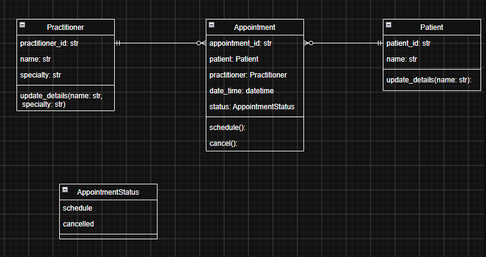

SmartCare v0.4 - Domain Implementation Workbook

Week 7 student resource

# 1\. UML-to-Code Trace

| UML element | Python element | Implemented? | Notes |
| --- | --- | --- | --- |
| Patient class | Patient | Yes | Represents one patient |
| Patient identifier | patient_id | Yes | String validated in the constructor |
| Patient name | name | Yes | Empty and whitespace-only names rejected |
| Patient update operation | update_details() | Yes | Safely updates the patient name |
| Practitioner class | Practitioner | Yes | Represents one practitioner |
| Practitioner identifier | practitioner_id | Yes | String validated in the constructor |
| Practitioner name | name | Yes | Empty and whitespace-only names rejected |
| Practitioner specialty | specialty | Yes | Added because Stage 4 explicitly requires it |
| Practitioner update operation | update_details() | Yes | Updates name and specialty after validation |

# 2\. Domain Invariants

| Class | Invariant / rule | How protected |
| --- | --- | --- |
| Patient | Patient identifier cannot be empty | Checked in the constructor and raises ValueError |
| Patient | Patient name cannot be empty or contain only spaces | Checked in the constructor and update_details() |
| Practitioner | Practitioner identifier cannot be empty | Checked in the constructor and raises ValueError |
| Practitioner | Practitioner name cannot be empty or contain only spaces | Checked in the constructor and update_details() |
| Practitioner | Specialty cannot be empty or contain only spaces | Checked in the constructor and update_details() |
|  |  |  |

# 3\. Composition / Inheritance Decisions

| Relationship | Decision | Rationale |
| --- | --- | --- |
| Appointment and Patient | Association | An Appointment references a Patient, but an Appointment is not a type of Patient |
| Appointment and Practitioner | Association | An Appointment references a Practitioner, but an Appointment is not a type of Practitioner |
| Doctor and Practitioner, hypothetical | Inheritance | A Doctor could be considered a specialised type of Practitioner |
| Clinic and Appointment | Association or composition | A Clinic could contain or manage appointments, but an Appointment is not a type of Clinic |
| Appointment and AppointmentStatus | Attribute relationship | Appointment has a status represented by an enum; it does not inherit from AppointmentStatus |

# 4\. AI Pair-Programming Record

| AI contribution | Conforms? | Decision | Reason | Verification |
| --- | --- | --- | --- | --- |
| Appointment class | Yes | Accepted | Directly matches the approved UML | Created a valid Appointment object |
| Patient reference | Yes | Accepted | Implements the Patient-to-Appointment association | Checked the Appointment’s patient attribute |
| Practitioner reference | Yes | Accepted | Implements the Practitioner-to-Appointment association | Checked the Appointment’s practitioner attribute |
| Type hints | Yes | Accepted | Required by Stage 4 | Inspected constructor and method signatures |
| AppointmentStatus enum | Yes | Accepted | Explicitly required by Stage 4 | Checked initial and cancelled status values |

# 5\. Updated UML

Insert updated UML only if implementation revealed a justified design change. Explain every change.

Practitioner was updated to include specialty as it’s clearly stated that it requires this. The appointment status type was changed from an unspecified status to AppointmentStatus. This contains scheduled and cancelled values. Attribute and parameter types were also added to improve flow between the UML and the python implementations. No extra database, notification, manager, etc. were added